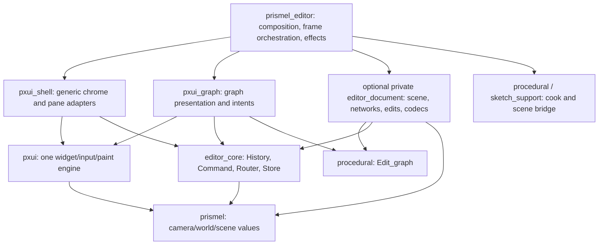

# Editor library boundaries, API maintenance, and guardrails

## Are the current library boundaries sound, and where is coupling accumulating?

### Takeaway

The existing library direction is largely the right design and does not justify a wholesale editor rewrite. The strongest improvement is to make the existing document/presentation seam real, starting with internal module extraction; a new library is worthwhile only if it enforces that seam through Dune dependencies.

### Cited Findings

- Current library dependencies separate generic state/routing (`editor_core`), widgets (`pxui`), generic editor chrome (`pxui_shell`), procedural graph presentation (`pxui_graph`), catalog definitions (`sop_catalog`), geometry-to-scene glue (`sketch_support`), and the final host (`prismel_editor`). `pxui_shell` depends only on Prismel/editor_core/PXUI; `pxui_graph` does not depend on the host or catalog. — [Dune editor_core](/Users/snowbear/WORK/GIT/prismel/lib/editor_core/dune:1), [shell](/Users/snowbear/WORK/GIT/prismel/lib/pxui_shell/dune:1), [graph](/Users/snowbear/WORK/GIT/prismel/lib/pxui_graph/dune:1), [editor](/Users/snowbear/WORK/GIT/prismel/lib/prismel_editor/dune:1).
- Dependency gate uses transitive forbidden-reach rules, including editor/UI/geometry separation, and has zero listed reach exceptions. This is stronger than checking only direct imports. — [rules](/Users/snowbear/WORK/GIT/prismel/test/dependency_gate.ml:107), [exceptions](/Users/snowbear/WORK/GIT/prismel/test/dependency_gate.ml:116).
- The document stores one scene graph, int-keyed child networks, active camera and sketch settings; selection/navigation/cooking are outside it. However, the document module also reads `Pxui_graph` viewed state and positions and creates/restores views. This means the nominal data model currently imports presentation. — [document structure](/Users/snowbear/WORK/GIT/prismel/lib/prismel_editor/document.ml:15), [view-dependent functions](/Users/snowbear/WORK/GIT/prismel/lib/prismel_editor/document.ml:35).
- Topology intent application in `Doc.apply` simultaneously updates the procedural graph and `Pxui_graph` presentation. This is an explicit adapter seam, not evidence of two graph authorities, but a document library cannot include this module unchanged. — [Doc.apply](/Users/snowbear/WORK/GIT/prismel/lib/prismel_editor/doc.ml:38).
- `Core` has 1,251 source lines and its state includes document/history, layout/view/tree/UI, timeline/cook worker, prompt/store context, command routing and row caches. `Core.update` contains command dispatch, pane construction, document transitions, history, persistence and cook scheduling. Large size alone is not a correctness defect; the mixed change reasons make it the best extraction target. — [state](/Users/snowbear/WORK/GIT/prismel/lib/prismel_editor/core.ml:46), [update](/Users/snowbear/WORK/GIT/prismel/lib/prismel_editor/core.ml:694), [post-frame/history/cook work](/Users/snowbear/WORK/GIT/prismel/lib/prismel_editor/core.ml:1040).
- Dimensional behavior is already shared through `Environment.Make`, with thin `Editor3` and `Editor2` wrappers. Preserve this rather than introducing separate hosts or update paths. — [shared viewport contract](/Users/snowbear/WORK/GIT/prismel/lib/prismel_editor/environment.ml:11), [wrappers](/Users/snowbear/WORK/GIT/prismel/lib/prismel_editor/prismel_editor.ml:21).
- The supposedly pure editor_core library includes filesystem effects and viewport serialization; `Store.save` uses temporary-file creation and rename, and `Store.Viewport` imports camera types. Its specifications explicitly acknowledge the Prismel dependency and storage role. This is a naming/documentation imprecision, not a forbidden edge or reason to split tiny modules today. — [effects](/Users/snowbear/WORK/GIT/prismel/lib/editor_core/store.ml:11), [viewport adapter](/Users/snowbear/WORK/GIT/prismel/lib/editor_core/store.ml:42), [current specification](/Users/snowbear/WORK/GIT/prismel/specification/backend.md:101).
- `Sketch_support.Timeline` is only 47 implementation lines; all but the final context constructor concern playback state/Prismel frames. Moving it would remove a generic-state placement oddity but would require API migration and moving the procedural context adapter. It is not sufficient benefit to justify a separate playback library. — [Timeline](/Users/snowbear/WORK/GIT/prismel/lib/sketch_support/timeline.ml:1), [procedural adapter](/Users/snowbear/WORK/GIT/prismel/lib/sketch_support/timeline.ml:45).
- Host operation-name comparisons such as `geometry`, `world`, and `camera` implement domain dispatch. The repository rule prohibits operation-name interpretation in `pxui_graph`, not in the host that owns scene semantics. The graph receives `flaggable` from the host and displays operation metadata. Do not misclassify legitimate host dispatch as a violation. — [host rule](/Users/snowbear/WORK/GIT/prismel/lib/prismel_editor/AGENTS.md:17), [host predicate](/Users/snowbear/WORK/GIT/prismel/lib/prismel_editor/core.ml:143), [graph creation contract](/Users/snowbear/WORK/GIT/prismel/lib/pxui_graph/pxui_graph.mli:89).

### Inferences

- **P1, maintainability risk:** Move view conversion (`displayed_of`, `of_view`, `edit`'s position acquisition, `to_view`) into an internal workspace/document-view adapter. Let Document accept IDs, positions and graphs as data. Move document transition policy out of the pane-building function, preserving current immutable values and intent types. This makes read-only analysis, serialization and invariant tests possible without building a UI frame.
- **Conditional P2 split:** If a compiler-enforced UI-free model boundary is wanted, create one **private** `editor_document` library containing Document, Settings, Objects, Layers, Preset and extracted document transitions. Dependencies should be `param`/`editor_core`, `procedural`, `prismel`, `yojson`, `unix`, and the existing PPX where needed; never `pxui`, `pxui_shell`, `pxui_graph`, `sketch_support`, or `prismel_editor`. Preset is UI-free today; Objects/Layers are UI-free today; Document is not. Dune must enforce the ban and dependency_gate must inject a violation against it. Do not promote a new public document API as a side effect.
- A module split inside the existing library improves navigation and review, but cannot forbid presentation imports because every module has the same Dune library dependencies. A library split without first removing UI references merely shuffles files and delivers no meaningful guarantee.
- Keep PXUI and graph rendering intact. The 2,091-line widget engine and 1,793-line graph module are complexity hotspots, but neither size nor mutable scratch buffers proves an architectural defect; investigate measured regressions and invariant failures before splitting them.

Suggested layering (arrows mean depends on; optional box is only added after extraction):



### Gaps

- This audit establishes source coupling and proposed enforcement, not measured maintenance cost or a runtime defect caused by Document's dependency. Do not claim the optional split is necessary to fix today's rendering failures.
- No unused-export deletion list is verified. Use the repository compiler-driven prune-dead-code workflow before deleting exports; grep absence alone cannot establish dead code.

## Which command, public API and testing issues need concrete fixes?

### Takeaway

There is one source-provable command-extension hazard and several guardrail/documentation gaps. Fix the extension boundary and existing red native checks before larger architecture work; preserve intentional command aliases and the shared input engine.

### Cited Findings

- **P1, confirmed extension-boundary behavior:** Sketch commands are appended after built-ins and are mapped to `Sketch_command id`; execution looks up the first sketch command with that ID. No validation occurs at construction. Two entries with one ID but different closures therefore execute the first closure even when the second entry's trigger was selected. — [construction](/Users/snowbear/WORK/GIT/prismel/lib/prismel_editor/environment.ml:236), [mapping](/Users/snowbear/WORK/GIT/prismel/lib/prismel_editor/environment.ml:248), [dispatch](/Users/snowbear/WORK/GIT/prismel/lib/prismel_editor/environment.ml:452).
- Concrete example: commands `{id="sketch.mode"; trigger=Leader "k"; action=increment}` followed by `{id="sketch.mode"; trigger=Leader "j"; action=reset}` cause Space-j to route `Sketch_command "sketch.mode"`, after which `List.find` chooses `increment`. Palette deduplicates by ID, retaining the first entry. A different ID using built-in `Leader "s"` loses keyboard dispatch to built-in save while remaining separately visible in the palette. These are deterministic deductions from the code, not an executed reproduction. — [first leader match](/Users/snowbear/WORK/GIT/prismel/lib/editor_core/editor_core.ml:145), [palette dedup](/Users/snowbear/WORK/GIT/prismel/lib/prismel_editor/core.ml:960), [save binding](/Users/snowbear/WORK/GIT/prismel/lib/prismel_editor/leader.ml:28).
- The public contract explicitly allows entries sharing an ID to represent one command. Built-in undo has several key bindings. Rejecting all repeated IDs would break the supported alias pattern. — [Command contract](/Users/snowbear/WORK/GIT/prismel/lib/editor_core/editor_core.mli:44), [built-in aliases](/Users/snowbear/WORK/GIT/prismel/lib/prismel_editor/leader.ml:70).
- **P2, test/public API coupling:** `Prismel_editor.Private` exposes Workspace, Leader, Document, Preset and Schedule in the public facade. Tests still use the Workspace compatibility facade even though the implementation is a three-line re-export of Pxui_shell.Layout/Chrome. The manifest excludes Private only for Prismel Font/Image, not this editor facade, so nominally unstable editor test internals still contribute to the frozen manifest. — [public Private](/Users/snowbear/WORK/GIT/prismel/lib/prismel_editor/prismel_editor.mli:40), [compatibility implementation](/Users/snowbear/WORK/GIT/prismel/lib/prismel_editor/workspace.ml:1), [tests](/Users/snowbear/WORK/GIT/prismel/test/test_prismel_editor.ml:68), [manifest exceptions](/Users/snowbear/WORK/GIT/prismel/tools/api_manifest/api_manifest.ml:25).
- **P2, stale contract:** pxui_graph's public comments still say leader `l` invokes optimize_layout. Current Leader binds it to graph/list projection and puts Layout in palette/context only. — [stale comment](/Users/snowbear/WORK/GIT/prismel/lib/pxui_graph/pxui_graph.mli:166), [actual bindings](/Users/snowbear/WORK/GIT/prismel/lib/prismel_editor/leader.ml:43), [palette-only layout](/Users/snowbear/WORK/GIT/prismel/lib/prismel_editor/leader.ml:65).
- **P1, gate coverage gap:** Gate graph parsing keeps atom library dependencies and resolves only registered internal names. Nested dependency expressions and unknown names are ignored. Current simple Dune stanzas fit the parser, but a green gate does not prove it models every future stanza. Token scans reject KeyPressed only in pxui_graph, not in all panes, and do not enforce operation-name independence, one Ui.frame ownership, no I/O during UI construction, or one capture path. — [parser](/Users/snowbear/WORK/GIT/prismel/test/dependency_gate.ml:39), [scan rules](/Users/snowbear/WORK/GIT/prismel/test/dependency_gate.ml:193).
- **P2, test isolation:** The top-level test executable links runtime, SDL, scene commands, procedural/PDK and the entire editor with `-linkall`; focused aliases narrow execution but not compilation/link dependencies. Existing logic tests bypass native framebuffer/capture assertions through a native flag. This is legitimate staged validation, but cannot substitute for the native aliases. — [test executable](/Users/snowbear/WORK/GIT/prismel/test/dune:1), [native branches](/Users/snowbear/WORK/GIT/prismel/test/test_prismel_editor.ml:874), [logic entry](/Users/snowbear/WORK/GIT/prismel/test/test_prismel_editor.ml:922).
- Catalog tests already instantiate every registered factory with disconnected slots, check runtime operation identity, and perturb every cook-impact schema field to check cache identity. Reuse these rather than adding a second registry/schema test framework. — [catalog-wide checks](/Users/snowbear/WORK/GIT/prismel/test/test_sop_catalog.ml:292).

### Inferences

- At Editor.create's extension boundary, define the collision policy and return Error for ambiguous supplied commands. Preserve built-in multiple-trigger aliases. For sketch command aliases, require one implementation per ID (physical closure identity is a minimal policy if explicitly documented), or keep one canonical action mapping and require alias entries to resolve consistently. Do not attempt polymorphic structural equality on function values. Trigger overlap must account for global versus pane scope and existing modifier specificity; do not naively reject every equal key across different scopes. Add one test covering ID mismatch, built-in trigger collision, valid multiple-trigger aliases and the intended scope policy. No new registry subsystem needed.
- Move Workspace tests to Pxui_shell's public Layout/Chrome and delete the compatibility facade only after its callers migrate. Decide explicitly whether Private editor modules remain supported test hooks, are removed through an internal test library, or are excluded from stable API hashing as already done for two Prismel modules. A manifest exclusion changes the stability promise and needs deliberate review; it is not the same as making modules actually inaccessible.
- Add gate assertions for new document library edges if the split happens; add one explicit injected example for each newly enforced rule. Avoid building a generic source analyzer to police every architecture sentence. For frame/input/effect boundaries, a small behavioral test is often stronger than matching tokens.
- Native results reported by root leave one immediate **P0** confidence blocker: look-through framebuffer mismatch at test_prismel_editor.ml:883 failed again when rerun serially. UI overlay fixture drift in the first concurrent run **passed serially** and must not be reported as a confirmed rendering defect. Native suites must run serially because shared native window/input state can contaminate simultaneous runs. Root also reports a reproduced modal wheel leak (palette scroll changes 3D distance 7 → 6.20844306 and 2D zoom 1 → 1.12749685) and hidden-shell focus retention across WindowFocusLost; the detailed proofs belong to the UI audit. Do not resolve failures by weakening expectations or bulk-promoting fixtures without inspecting the result.

### Gaps

- No runnable command-collision regression was added or executed: assignment was audit-only and Dune ownership stayed with root. The report must retain that qualification.
- No unsupported nested Dune library expression was found in these editor stanzas. Parser weakness is prospective coverage debt, not a demonstrated current boundary bypass.
- Native pass/fail evidence must come from root's actual command output. This file records root's reported results and source coverage, not an independent native run. Root also reports that the added catalog, bridge, SOP UI and API manifest aliases passed.

## Which mature patterns should guide the plan and its acceptance gates?

### Takeaway

Mature editors support a single command identity across presentation/input surfaces, a model that is independent of its views, and narrow context-aware adapters. Prismel already implements much of that; apply the principles to the existing seams rather than importing another editor framework.

### Cited Findings

- VS Code registers commands by identifier and reuses the command through buttons, keybindings and programmatic execution. Contribution metadata controls presentation, while an enablement condition differs from whether a menu shows the item. — [VS Code Commands](https://code.visualstudio.com/api/extension-guides/command). Relevant inference: keep Prismel's existing Command entries as the shared source, define collision/availability semantics, and test that palette and keys select the same action.
- Qt separates storage from presentation so multiple views can display the same data without changing its underlying structures; views obtain model references and delegates handle presentation/edit interaction. — [Qt Model/View Programming](https://doc.qt.io/qt-6/model-view-programming.html). Relevant inference: retain Procedural.Edit_graph as graph authority and remove Pxui_graph conversion from Document. This does not require Qt's class hierarchy, signals or a new reactive framework.
- Blender's operator guidance describes operators as controllers connecting UI to application data; it advises high-level module calls instead of mixed-level business logic inside callbacks and warns against spreading UI context into lower-level functions. Its context documentation distinguishes interactive code from evaluation/rendering code that must receive explicit data and not assume a window manager. — [Blender Operators](https://developer.blender.org/docs/features//interface/operators/), [Blender Context](https://developer.blender.org/docs/features/core/context/). The search engine supplied substantial primary-source excerpts; full fetch was blocked with 402, so this finding relies on indexed excerpts. Relevant inference: the Core pane callback should collect results, while document transitions consume explicit immutable values outside painting.

### Inferences

Ordered work:

1. **P0: restore trustworthy native evidence.** Diagnose the serially reproduced editor framebuffer assertion and the modal/focus failures. Require the same assertions to pass with current layout/camera behavior, inspect rendered overlays, and retain the 1-/4-domain framebuffer parity evidence. The serial UI fixture check already passes. No library moves in this phase.
2. **P1: fix command-extension ambiguity and strengthen changed seams.** Add construction-time command collision policy and the single regression above; use existing result-returning create boundary. Add any behavioral check for a currently uncovered invariant exposed during this audit. Acceptance: keyboard/palette equivalence, valid aliases, no silent conflicting action identity, built-in scope behavior unchanged.
3. **P1: extract the document adapter and reducer within prismel_editor.** Keep existing types initially, move conversion out of Document, separate document transition policy from widget building, and preserve single History ownership. Acceptance: Document imports no PXUI modules; preset bytes and v1/v2 round trips remain supported; graph/list/inspector/camera edits still undo through the same history; selection/navigation remain unsaved view state; object transforms do not force SOP recook.
4. **Conditional P2: establish private editor_document library.** Only after phase 3, add the Dune boundary if compiler enforcement earns its maintenance cost. Acceptance: new library cannot reach any presentation library, gate's injected bad edge fails, host remains the only composition/effect owner, public Editor2/3 signatures stay unchanged unless intentionally reviewed. No new generic pane plugin/docking framework.
5. **P2: remove proven compatibility/API cruft.** Migrate Workspace facade tests, then delete facade if there are zero supported callers; align the public Private stability policy; correct graph shortcut documentation. Keep existing aliases/import paths temporarily where migration requires them. Acceptance: exact public manifest diff reviewed, intended changes promoted only after review, documentation and teaching examples reflect the final API.

Combined focused validation command (root already ran a subset; this includes catalog/schema/bridge/manifest boundaries):

```sh
dune build @check @lib/editor_core/runtest @lib/pxui/runtest @lib/pxui_shell/runtest @test/test_pxui_graph @test/test_prismel_editor_logic @test/test_scene_tree @test/test_sop_catalog @test/test_sop_ui @test/test_sketch_support @test/dependency_gate @tools/api_manifest/runtest
```

Required native complement, on real display/Metal, deliberately sequenced so Dune cannot execute separate native suites together:

```sh
dune build @lib/pxui/test_ui_parity && dune build @test/test_prismel_editor && dune build @smoke
```

Repository completion gate after actual implementation:

```sh
dune build @all && dune runtest && dune build @smoke && git diff --check
```

`@doc` should also pass after public/documentation changes. Run meaningful focused checks once per change; broaden when implementation reaches multiple libraries. A green source dependency gate alone cannot prove interaction, durability, framebuffer parity, or lifecycle correctness.

### Gaps

- No implementation was requested from this researcher, so none of the plan is marked completed.
- No claim of a rock-solid whole editor is supported by this audit, particularly while native checks are red. The defensible outcome is a sound base, specific verified risks and an ordered plan with enforceable acceptance conditions.
